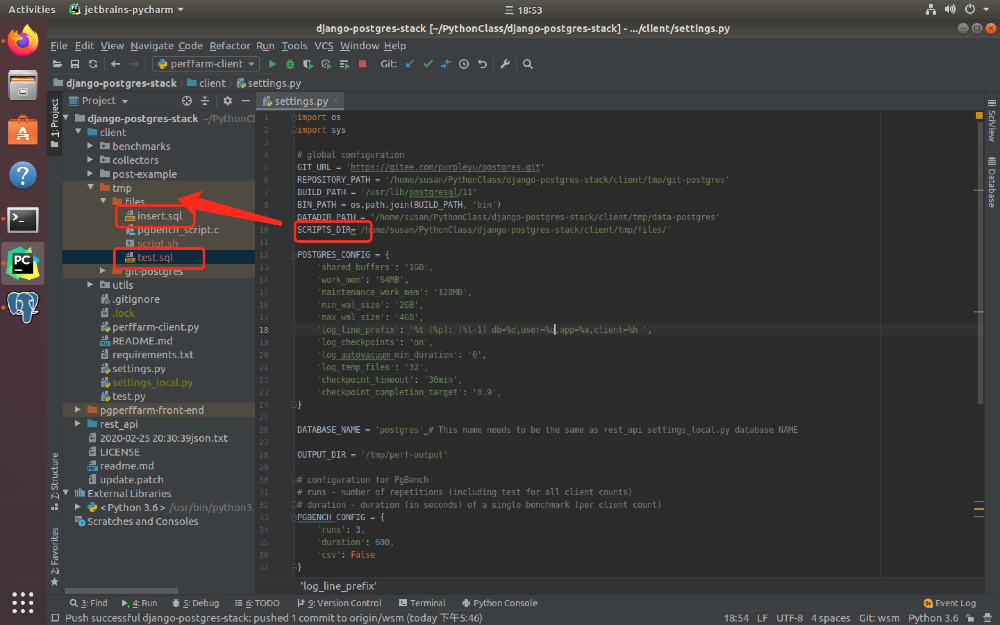
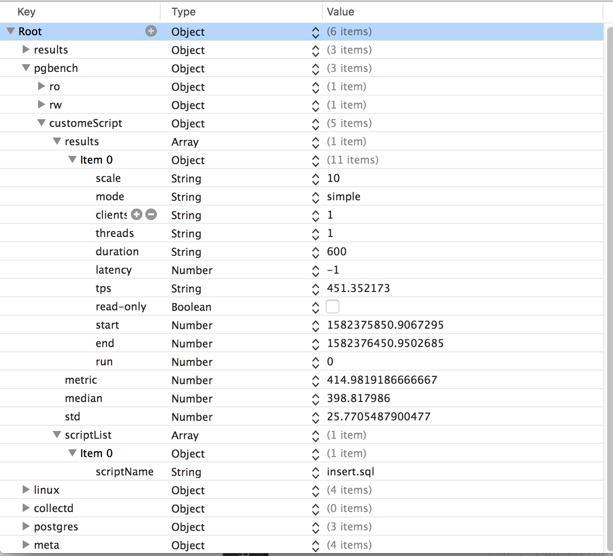
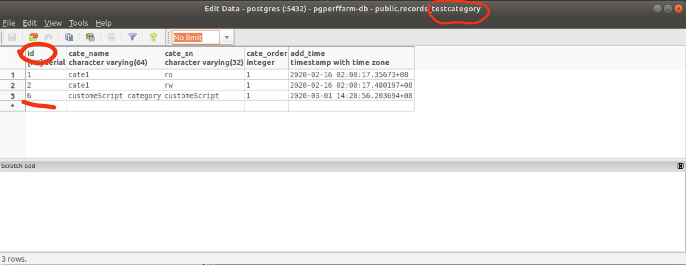
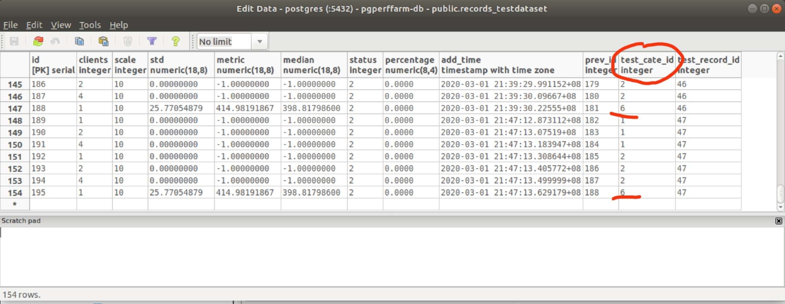
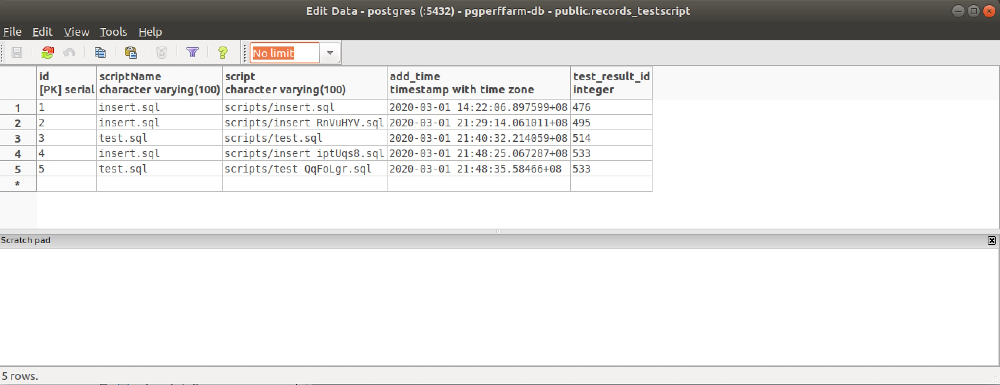

# custom scripts

## Project Description 

To allow user running custom scripts, not just the default read-write/read-only tests!

# Getting Started
1. set up custom script root folder 
 modify const `SCRIPTS_DIR` in `client/setting.py` to indicate custom script root path 
1. put some custom sql files under  `SCRIPTS_DIR` folder，

1. start service `python3 manage.py runserver`
2. start client `python3 perffarm-client.py`
3. the bgbench result and all the sql file under your `SCRIPTS_DIR`  gonna automatly save to  `pgperffarm-db` 

## Implementation Details

### [client/collectors/scripts.py](https://github.com/chouchouyu/django-postgres-stack/blob/wsm/client/collectors/scripts.py) 

`scripts.py` is the main class for collecting scripts , run cmd and generate upload json.

|method   | result  | description|
| --- | --- | --- |
| hasScript | Ture/False | if custom script dir exist and with sql file in it return true,or else return false |
| run_custem_script | return run_cmd result | run bgbench cmd like  "pgbench -f a.sql -f b.sql -f … dbname" | scripts collect with some method use for scriptcollection and jsonFormat.
|getScriptListJson|json|perpare custome script information json 

### upload json and file 
#### jsona part
1. we add a `customeScript` JsonObject to descrip custem scriptt result.

* if with no custom script situation,the `customeScript` is a empty JsonObject.

#### file part
 the customeScript sql files are also be uploaded to the server.

### server part 
1. add `customeScript` and complete the related Django rest framwork

2. add `customeScript` type  in `testCategory` table in the database.

3. upload result in db(6 indicate is a customeScript type)

4. script files are saved in db. 
 

# Future work
add GUI for command line for environment setups.

# PR summary

 

